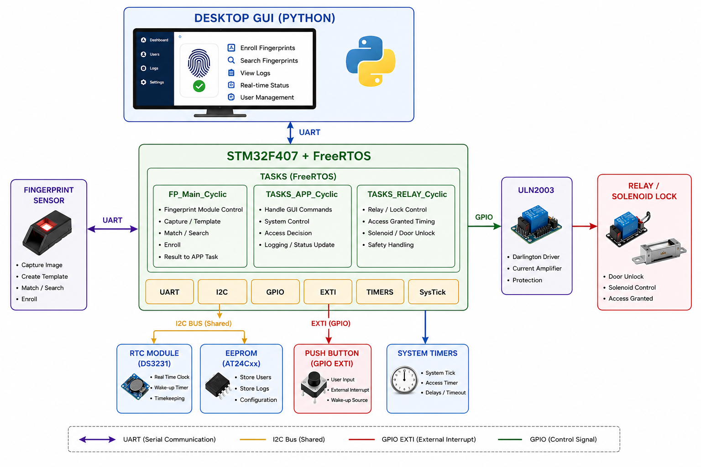
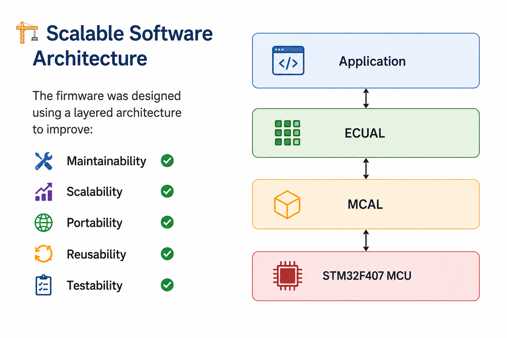
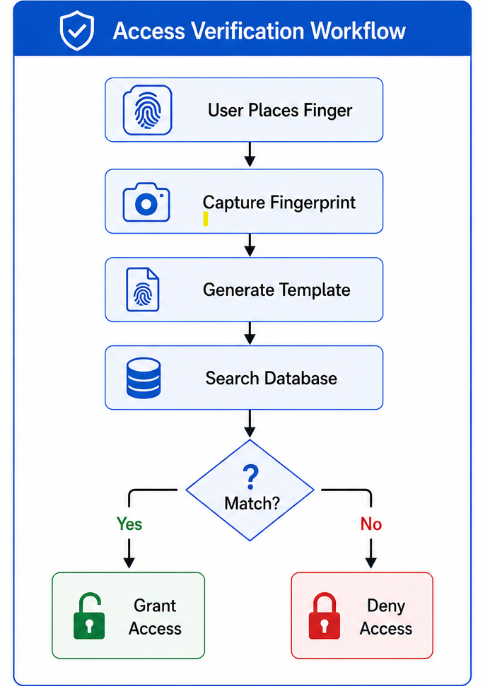
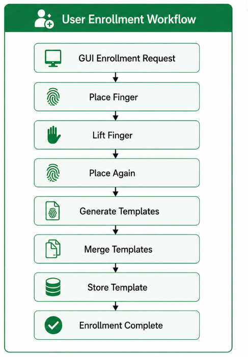
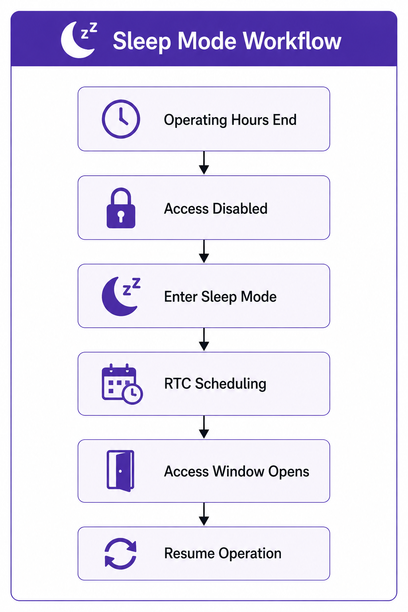
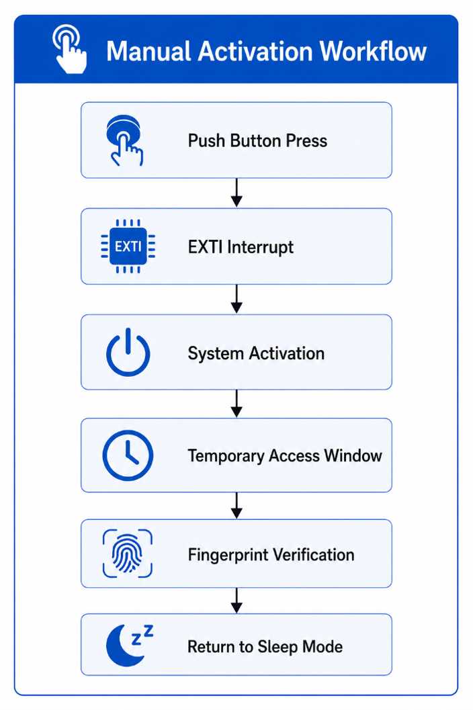
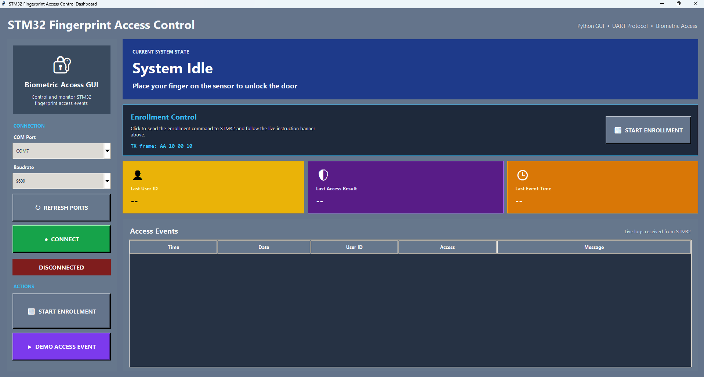
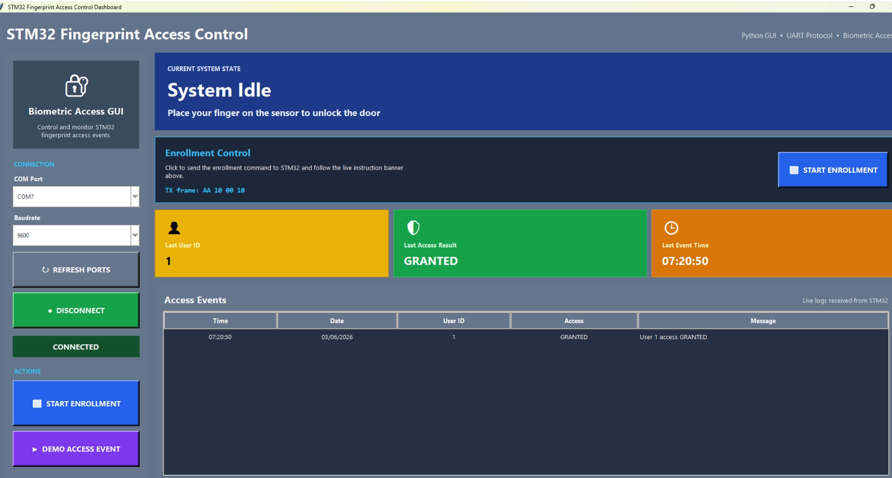
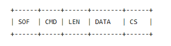
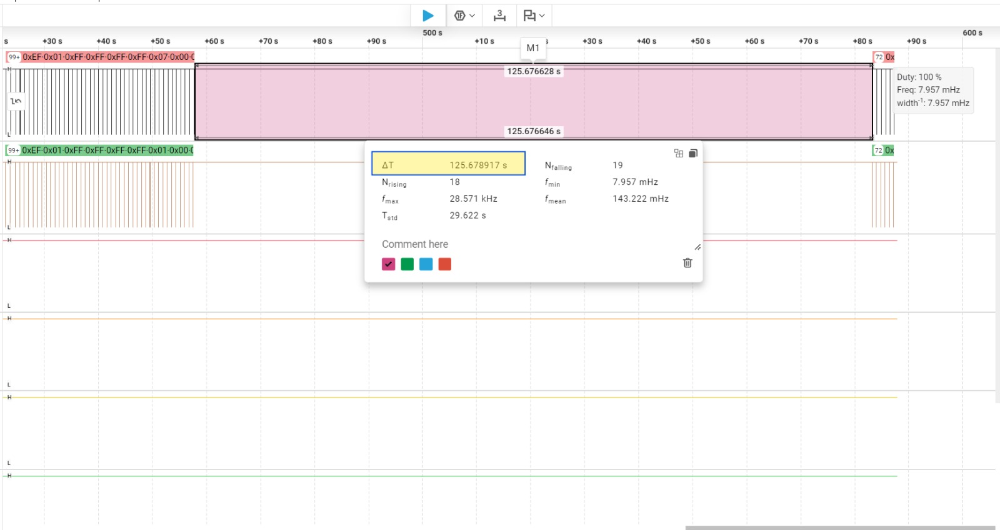

# 🔐 Fingerprint Access Control System (STM32F407 + FreeRTOS)

  

An embedded access control system developed on the **STM32F407** microcontroller that combines **fingerprint authentication**, **real-time task scheduling**, **asynchronous communication**, **access scheduling**, and **power-aware system operation** within a scalable layered software architecture.

The project was designed around three key engineering objectives:

- ⚡ **Non-Blocking Execution**
- 🔋 **Power Efficiency**
- 🏗️ **Scalable Software Architecture**

The system demonstrates practical embedded software engineering techniques used in commercial embedded products, including **FreeRTOS multitasking**, **interrupt-driven communication**, **driver abstraction**, **state-machine design**, **RTC integration**, **external interrupt handling**, and **event-driven application development**.

---

## 📹 Project Demonstration

🎥 **Project Demo:** *(Insert LinkedIn or YouTube link)*

---

## 📖 Project Overview

The **Fingerprint Access Control System** authenticates users through a fingerprint sensor and controls physical access using a relay-driven door lock mechanism.

A desktop **Python GUI** communicates with the STM32F407 through a custom UART protocol, allowing operators to enroll new users, monitor authentication activity, and observe system status in real time.

To improve energy efficiency, access is only permitted during predefined operating windows.

| Access Period | Status |
|--------------|--------|
| 07:00 AM – 09:00 AM | ✅ Access Enabled |
| 04:00 PM – 06:00 PM | ✅ Access Enabled |
| All Other Times | ❌ Access Disabled |

Outside these periods, the system automatically enters **Sleep Mode** to reduce processor activity and power consumption.

An external **DS1307 RTC module** maintains accurate timekeeping independently of MCU operation, while the STM32 internal RTC is synchronized and used to schedule wake-up alarms.

An external push button connected through **EXTI** can temporarily activate the system outside normal operating hours.

---

## ✨ Key Features

### 🔐 Access Control

- Fingerprint authentication
- User enrollment
- User identification
- Access grant / deny decisions
- Relay-controlled door lock

### ⚙️ Embedded Software

- FreeRTOS multitasking
- Interrupt-driven communication
- Custom asynchronous UART driver
- State-machine-based enrollment
- Event-driven application design
- Layered firmware architecture

### 🔋 Power Management

- Scheduled operating windows
- Automatic Sleep Mode entry
- RTC-based scheduling
- RTC alarm wake-up
- EXTI manual activation
- Reduced processor activity outside access periods

### 🖥️ Desktop GUI

- Python GUI
- Real-time enrollment feedback
- Authentication status display
- Access granted / denied indication
- User ID display
- Event monitoring
- UART communication interface

---

## 🏗️ High-Level System Architecture

  

  <em>High-level system architecture showing the GUI, STM32 firmware layers, FreeRTOS tasks, and external hardware modules.</em>

---

## 🎯 Engineering Objectives

### ⚡ Non-Blocking Execution

One of the primary goals of this project was to avoid unnecessary CPU blocking and allow multiple software activities to execute concurrently.

Traditional embedded applications often rely heavily on polling loops and blocking delays. This approach can waste processor time and reduce responsiveness, especially when dealing with communication, authentication, timing, and user interaction at the same time.

To avoid these limitations, the system was built around:

- FreeRTOS-based multitasking
- Interrupt-driven peripheral handling
- Event-based task synchronization
- Non-blocking communication
- Queue-based data handling

### Custom Asynchronous UART Driver

A custom UART driver was developed specifically for this project.

The driver supports:

- Interrupt-driven TX/RX
- Cyclic TX/RX processing
- Background communication
- FreeRTOS queue integration
- Non-blocking APIs

This allows the desktop GUI communication to run in the background while fingerprint processing, relay control, and application scheduling continue executing normally.

---

### 🔋 Power Efficiency

The access control system operates only during predefined authorized access periods.

| Time Window | Access Status |
|------------|---------------|
| 07:00 AM – 09:00 AM | Enabled |
| 04:00 PM – 06:00 PM | Enabled |
| All Other Times | Disabled |

When the system is outside these windows:

- Access requests are rejected
- Fingerprint processing is suspended
- CPU activity is reduced
- The MCU enters Stop Mode
- RTC-based timekeeping continues

When access becomes available again:

- The internal RTC alarm wakes the STM32
- System services are restored
- FreeRTOS tasks resume operation
- Fingerprint verification becomes available again

Additional power management features include:

- Sleep Mode operation
- RTC scheduling
- Event-driven wake-up
- EXTI-based manual activation
- Reduced processor utilization

---

### 🏗️ Scalable Software Architecture

The firmware follows a layered architecture to separate system behavior from hardware-specific implementation.

- **Application Layer** defines the main system behavior.
- **ECUAL Layer** manages external hardware devices.
- **MCAL Layer** abstracts STM32 peripherals.

This separation allows hardware modules and software components to be modified independently without impacting the full system.

Benefits include:

- Better maintainability
- Improved scalability
- Cleaner driver reuse
- Easier testing and debugging
- Better separation between application logic and hardware control

---

## 🏛️ Firmware Architecture

  

  <em>Layered firmware architecture separating application logic, external component drivers, and MCU peripheral drivers.</em>

### Application Layer

The application layer contains the core system behavior.

Responsibilities include:

- Access control decisions
- Enrollment workflow
- User authentication
- Sleep Mode management
- Access scheduling
- GUI communication
- System coordination

### ECUAL Layer

The ECUAL layer abstracts external hardware modules.

Implemented modules include:

- EEPROM driver
- Fingerprint sensor driver
- Internal RTC Driver
- Relay driver
- External RTC driver

### MCAL Layer

The MCAL layer provides low-level STM32 peripheral drivers.

Implemented drivers include:

- **EEPROM Driver** – Stores enrolled fingerprints and system configuration in non-volatile memory.
- **Fingerprint Sensor Driver** – Handles fingerprint enrollment, identification, and communication with the sensor.
- **Internal RTC Driver** – Manages timekeeping and scheduled wake-up events from Stop Mode.
- **Relay Driver** – Controls the door lock relay through GPIO.
- **External RTC Driver** – Maintains accurate date and time via an external I²C RTC module.

---

## 🧵 FreeRTOS Architecture

The application is organized into multiple FreeRTOS tasks.

| Task | Responsibility |
|------|----------------|
| Fingerprint Task | Enrollment and authentication processing |
| Application Task | System coordination, scheduling, and access decisions |
| Relay Task | Relay timing and door lock control |

Using FreeRTOS provides:

- Improved responsiveness
- Better separation of functionality
- Concurrent processing
- Simplified maintenance
- Improved scalability

---

## 🔄 System Workflows

### Access Verification

  

The access verification workflow handles fingerprint search, user identification, access decision-making, and relay activation when the user is authorized.

---

### User Enrollment

  

The enrollment workflow guides the user through the fingerprint registration sequence using GUI feedback and fingerprint sensor commands.

---

### Sleep Mode Workflow

  

The Sleep Mode workflow manages the transition from normal operation into low-power mode when the access period ends, then restores system operation when the next access window begins.

---

### Manual Activation Workflow

  

The manual activation workflow allows the system to temporarily wake outside the normal schedule using an EXTI push button.

---

## 🖥️ Desktop GUI

A custom Python GUI was developed to provide a user-friendly interface for system management.

GUI features include:

- User enrollment
- Enrollment progress display
- Access granted indication
- Access denied indication
- User ID display
- Event timestamps
- Real-time system feedback
- UART communication interface

  
  

  <em>Python desktop GUI used for enrollment, authentication monitoring, and system feedback.</em>

---

## STM32 ↔ Desktop GUI Communication

The STM32 and desktop GUI communicate using a custom-designed packet-based UART protocol that enables reliable bidirectional communication between the firmware and the GUI.

  

### Frame Structure

| Field | Description |
|------|-------------|
| SOF | Start of Frame |
| CMD | Command Identifier |
| LEN | Payload Length |
| DATA | Payload Data |
| CS | XOR Checksum |

### Example Commands

| Command | Description |
|---------|-------------|
| 0x10 | Enrollment Request |
| 0x11 | Enrollment Status |
| 0x12 | Access Event Log |

---

## 🔌 Hardware

### Main Controller

- STM32F407G-DISC1

### Peripherals

- Fingerprint Sensor
- DS3231 RTC Module
- I²C EEPROM
- ULN2003 Driver
- Relay Module
- Solenoid Lock
- Push Button connected through EXTI
- UART interface to desktop GUI

---

## 🛠️ Development Tools

- STM32CubeIDE
- FreeRTOS
- Python
- Git
- GitHub
- VS Code
- ST-Link
- Logic Analyzer

---

## 📸 Power Management Verification

Power efficiency was verified using a logic analyzer capture.

The capture demonstrates:

- Normal system operation
- Transition into Stop Mode
- Approximately 125 seconds of low-power inactivity
- Internal RTC alarm wake-up event
- Automatic restoration of system operation
- Resumption of fingerprint authentication services

  

  <em>Logic analyzer capture showing Sleep Mode operation and automatic RTC wake-up.</em>

During Stop Mode, application tasks are suspended and peripheral activity is minimized to reduce power consumption. The external DS3231 RTC continues maintaining accurate time independently of MCU operation. The STM32 internal RTC is synchronized with the external RTC and is used to generate scheduled wake-up alarms.

This verifies:

- Correct entry into Stop Mode
- RTC alarm-based wake-up
- Reliable recovery from low-power operation
- Autonomous time-based access control
- Restoration of normal fingerprint authentication services

---

## 🎥 Demonstrated Features

### Demo 1 – Registered User Access

- ✅ User authenticated
- ✅ Access granted
- ✅ Relay activated

### Demo 2 – User Enrollment

- ✅ Unknown user detected
- ✅ Enrollment performed
- ✅ User authenticated successfully

### Demo 3 – Automatic Sleep Entry

- ✅ Access period expires
- ✅ System enters Stop Mode

### Demo 4 – Scheduled System Resume

- ✅ Access period begins
- ✅ System resumes operation
- ✅ Authentication services restored

### Demo 5 – EXTI Activation

- ✅ Push button pressed
- ✅ EXTI interrupt generated
- ✅ Temporary activation window enabled

---

## 📈 Project Results

- ✅ Fully functional fingerprint authentication
- ✅ FreeRTOS multitasking implementation
- ✅ Custom asynchronous UART driver
- ✅ Stop Mode integration
- ✅ RTC scheduling implementation
- ✅ EXTI activation support
- ✅ Desktop GUI integration
- ✅ Layered firmware architecture
- ✅ Event-driven system behavior

---

## 🚀 Future Improvements

- Configurable access schedules through the GUI
- Secure storage of user metadata
- Encrypted UART communication
- SD card event logging
- BLE or Wi-Fi monitoring
- OTA firmware update support

---

## 👨‍💻 Author

**Ahmed Abdelrhman**

Embedded Systems Engineer

Focused on:

- Embedded Firmware Development
- STM32 Microcontrollers
- FreeRTOS
- Driver Development
- Low-Power Systems
- Industrial Automation
- Access Control Systems

---

⭐ **If you found this project interesting, please consider giving it a star.**
